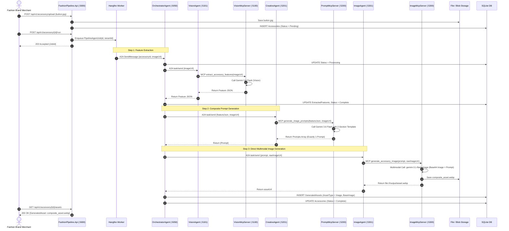

# Phase 1 Architecture: Automated Fashion Accessory Marketing Pipeline

**Document Status:** Production Verified — Multi-Agent A2A Protocol + DotnetFastMCP Servers  
**Target Version:** .NET 8 / .NET 9 (Cloud-Agnostic, Containerized, Multi-Tenant)  

---

## 1. Executive Summary & System Overview

The **Fashion Accessory AI Pipeline** automates the end-to-end transformation of a raw fashion accessory photograph (such as designer buttons, zari lace, border trims, brooches, or latkans) into publication-ready, 2-section marketing assets and video content.

### Core Architectural Principles:
1. 🌐 **Horizontal A2A Protocol (Agent-to-Agent):** Each specialized agent is an independent ASP.NET Core HTTP microservice communicating via the standard [Google A2A Protocol](https://a2a-protocol.org) (JSON-RPC 2.0 over HTTP), publishing discoverable Agent Cards at `/.well-known/agent.json`.
2. 🏗️ **Vertical MCP Tool Layer (DotnetFastMCP):** Every domain tool runs as a standalone **DotnetFastMCP** server on a dedicated port. Agents interact strictly with their assigned MCP server, enforcing clean separation of concerns and native ASP.NET Core Dependency Injection.
3. 🎨 **Multimodal Dual-Conditioning Generation:** Instead of relying on text prompts alone, the pipeline feeds the physical accessory image alongside structured layout prompts into advanced multimodal models (`gemini-3.1-flash-image`), achieving faithful replication of intricate physical textures, silhouettes, and finishes.
4. 📐 **Structured 2-Section Composite Format:**
   - **Top 20% Section:** Macro close-up of the exact accessory on an aesthetically paired luxury surface with crisp metadata banner overlay (`COLOR | TYPE | DIMENSION`).
   - **Bottom 80% Section:** High-fashion full-body portrait of an executive model wearing an Indian designer suit with the exact accessory applied down plackets, cuffs, or borders.
5. 🛡️ **Enterprise SaaS Multi-Tenancy & Caching:** Strict tenant isolation via EF Core Global Query Filters and SHA-256 image hashing to prevent redundant vision extraction costs.

---

## 2. Component Architecture Diagram

```mermaid
graph TD
    classDef user fill:#2C3E50,stroke:#34495E,color:#FFF
    classDef api fill:#2980B9,stroke:#2980B9,color:#FFF
    classDef orchestrator fill:#8E44AD,stroke:#8E44AD,color:#FFF
    classDef agent fill:#16A085,stroke:#16A085,color:#FFF
    classDef mcp fill:#D35400,stroke:#D35400,color:#FFF
    classDef db fill:#27AE60,stroke:#27AE60,color:#FFF
    classDef external fill:#F39C12,stroke:#F39C12,color:#FFF

    User[E-Commerce Admin / Merchant]:::user
    UI[Swagger / Web Portal]:::user
    API[FashionPipeline.Api :5000]:::api
    HF[Hangfire Job Queue]:::api

    subgraph A2A Layer - Horizontal Agent Communication
        OA[OrchestratorAgent :5050]:::orchestrator
        VA[VisionAgent :5101]:::agent
        CA[CreativeAgent :5201]:::agent
        IA[ImageAgent :5301]:::agent
        IPA[InpaintingAgent :5501]:::agent
        VDA[VideoAgent :5401]:::agent
    end

    subgraph MCP Layer - Vertical Tool Execution (DotnetFastMCP)
        VM[VisionMcpServer :5100]:::mcp
        PM[PromptMcpServer :5200]:::mcp
        IM[ImageMcpServer :5300]:::mcp
        IPM[InpaintingMcpServer :5500]:::mcp
        VDM[VideoMcpServer :5400]:::mcp
    end

    subgraph Data & Storage
        DB[(SQLite / PostgreSQL)]:::db
        Storage[(Local / Cloudflare R2 / Azure Blob)]:::db
    end

    subgraph External AI Engines
        GeminiFlash[Gemini 3.6 Flash]:::external
        GeminiImage[Gemini 3.1 Flash Image]:::external
        AzureFoundry[Azure OpenAI / FLUX Fallback]:::external
        VTON[Virtual Try-On / Inpainting]:::external
        Kling[Kling AI Video]:::external
    end

    User --> UI --> API
    API --> HF
    HF -->|A2A task/send| OA
    OA -->|A2A task/send| VA
    OA -->|A2A task/send| CA
    OA -->|A2A task/send| IA
    OA -.->|Optional A2A| IPA
    OA -.->|Optional A2A| VDA

    VA -->|MCP extract_accessory_features| VM --> GeminiFlash
    CA -->|MCP generate_image_prompts| PM --> GeminiFlash
    IA -->|MCP generate_accessory_image| IM --> GeminiImage
    IPA -->|MCP inpaint_accessory| IPM --> VTON
    VDA -->|MCP generate_accessory_video| VDM --> Kling

    IM --> Storage
    IPM --> Storage
    VDM --> Storage
    API --> DB
    OA --> DB
```

---

## 3. Detailed Component Breakdown

### 3.1 Ingestion & Control API (`FashionPipeline.Api` — Port 5000)
- **Role:** Secure multi-tenant entry point for uploading assets and monitoring pipeline execution.
- **Key Endpoints:**
  - `POST /api/v1/accessory/upload`: Uploads raw accessory photo, computes SHA-256 hash, creates record.
  - `POST /api/v1/accessory/{id}/run`: Enqueues an on-demand `PipelineAgentJob` via Hangfire.
  - `GET /api/v1/accessory/{id}/assets`: Retrieves generated marketing assets and metadata.
  - `PATCH /api/v1/assets/{assetId}/approval`: Merchant approval workflow for published assets.

### 3.2 Horizontal Agent Layer (A2A Protocol)
Each agent runs as an isolated microservice communicating via standard JSON-RPC 2.0 messages over HTTP:

| Service | Port | A2A Protocol Role | Upstream / Downstream |
|---|---|---|---|
| **`OrchestratorAgent`** | `5050` | Pipeline Coordinator. Receives Hangfire trigger, executes sequential chain, manages step-by-step state and asset persistence. | Hangfire → Orchestrator → Agents |
| **`VisionAgent`** | `5101` | Vision Specialist. Formats image payload and invokes Vision MCP. | Orchestrator → VisionAgent |
| **`CreativeAgent`** | `5201` | Prompt Engineer. Injects extracted features into structured composite templates. | Orchestrator → CreativeAgent |
| **`ImageAgent`** | `5301` | Image Synthesis Specialist. Manages multimodal image generation tool execution. | Orchestrator → ImageAgent |
| **`InpaintingAgent`** | `5501` | Virtual Try-On Specialist. Handles IDM-VTON / inpainting pipelines when needed. | Orchestrator → InpaintingAgent |
| **`VideoAgent`** | `5401` | Video Animation Specialist. Manages asynchronous video generation tasks. | Orchestrator → VideoAgent |

### 3.3 Vertical Tool Layer (DotnetFastMCP Servers)
Built on **DotnetFastMCP**, these servers expose strongly typed `[McpTool]` capabilities with native DI:

| MCP Server | Port | Tool Method | Underlying AI Model / Engine | Output |
|---|---|---|---|---|
| **`VisionMcpServer`** | `5100` | `extract_accessory_features` | `gemini-3.6-flash` (or Azure GPT-4o) | Structured JSON with color, material, texture, silhouette, and dimensions. |
| **`PromptMcpServer`** | `5200` | `generate_image_prompts` | `gemini-3.6-flash` + `creative_prompt_template.md` | Strict 2-part horizontal composite prompt (9:16 aspect ratio). |
| **`ImageMcpServer`** | `5300` | `generate_accessory_image` | `gemini-3.1-flash-image` (Multimodal with reference base64) | 9:16 high-resolution WebP composite asset with banner & applied accessory. |
| **`InpaintingMcpServer`**| `5500`| `inpaint_accessory` | OOTDiffusion / IDM-VTON / Replicate | Inpainted VTON fashion model asset. |
| **`VideoMcpServer`** | `5400` | `generate_accessory_video` | Kling AI Image-to-Video API | 1080p MP4 runway video clip. |

---

## 4. End-to-End Execution Flow



---

## 5. Key Resilience & Cost Optimization Patterns

1. **SHA-256 Image Hash Cache:** Prevents duplicate vision API calls when the same accessory photo is processed across multiple campaigns.
2. **Exponential Backoff & Rate-Limit Shield:** Built-in 429 backoff handling (15s–45s) across Gemini Flash and Image endpoints to respect Google AI Studio tier limits.
3. **Decoupled Step Persistence:** Each pipeline step immediately commits its intermediate outputs (Features, Prompts, Images) to the database, ensuring zero loss of progress if a downstream service fails.
4. **Dual Provider Agility:** Seamlessly toggle between Google AI Studio (`gemini-3.6-flash` / `gemini-3.1-flash-image`) and Azure AI Foundry (`gpt-5.6-sol` / `FLUX.1-Kontext-pro`) via `appsettings.json` configuration without code changes.
